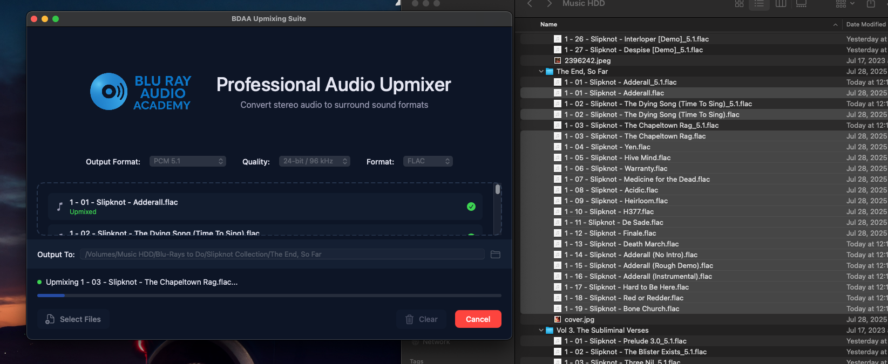

# BDAA Upmixing Suite

A professional macOS application for converting stereo audio files to various surround sound formats including PCM, Dolby Atmos, and DTS Master Audio.

## Features

### 🎵 Multiple Audio Format Support
- **PCM 2.0** - Stereo audio (no upmixing)
- **PCM 5.1** - 5.1 surround sound upmixing
- **PCM 7.1** - 7.1 surround sound upmixing
- **Dolby Atmos** - Object-based audio with height channels (7.1.4)
- **DTS Master Audio** - High-quality DTS encoding

### 🔧 Flexible Quality Options
- **16-bit / 48 kHz** - Standard quality
- **24-bit / 48 kHz** - Professional quality
- **24-bit / 96 kHz** - High resolution
- **24-bit / 192 kHz** - Audiophile quality
- **32-bit / 48 kHz** - Maximum bit depth
- **32-bit / 96 kHz** - High resolution with maximum bit depth
- **32-bit / 192 kHz** - Ultimate quality

### 📁 Multiple File Format Support
- **FLAC** - Free Lossless Audio Codec
- **ALAC** - Apple Lossless Audio Codec
- **WAV** - Uncompressed audio
- **AIFF** - Audio Interchange File Format
- **DTS** - For DTS Master Audio output
- **TrueHD** - For Dolby Atmos output

### 🖱️ Intuitive User Interface
- **Drag & Drop** - Drop audio files directly into the main area
- **Smart Format Restrictions** - File formats automatically filter based on output type
- **Folder Drop Support** - Drag folders directly into the output directory field
- **Professional Dark Blue Theme** - Easy on the eyes for long sessions
- **Real-time Progress Tracking** - Monitor conversion status for each file

## System Requirements

- macOS 11.5 or later
- FFmpeg (automatically detected or install via Homebrew: `brew install ffmpeg`)
- Sufficient disk space for output files

## Installation

1. Clone this repository
2. Open `BDAA Upmixing Suite.xcodeproj` in Xcode
3. Build and run the project
4. Ensure FFmpeg is installed on your system

## Usage

1. **Select Output Format** - Choose your desired surround sound format
2. **Choose Quality** - Select bit depth and sample rate (for PCM formats)
3. **Pick File Format** - Choose output container format
4. **Add Audio Files** - Drag audio files into the drop area or click "Select Files"
5. **Set Output Directory** - Drag a folder into the output field or click the folder icon
6. **Convert** - Click the convert button to start processing

## Smart Format Logic

The application intelligently restricts file format options based on your output format selection:

- **PCM Formats** (2.0, 5.1, 7.1): FLAC, ALAC, WAV, AIFF available
- **Dolby Atmos**: Only TrueHD (.thd) available
- **DTS Master Audio**: Only DTS (.dts) available

## Technical Details

### Audio Processing
- Uses FFmpeg for high-quality audio processing
- Implements sophisticated channel mapping for upmixing
- Maintains audio quality with professional-grade codecs
- Supports security-scoped bookmarks for sandboxed file access

### Upmixing Algorithms
- **5.1 Upmixing**: Intelligent center channel creation and surround distribution
- **7.1 Upmixing**: Adds back surround channels with proper phase relationships
- **Dolby Atmos**: Creates height channels for immersive 3D audio experience
- **DTS Master Audio**: Preserves dynamic range with lossless compression

## File Format Specifications

| Format | Container | Codec | Best For |
|--------|-----------|-------|----------|
| FLAC | .flac | flac | Open source lossless |
| ALAC | .m4a | alac | Apple ecosystem |
| WAV | .wav | pcm_s32le | Universal compatibility |
| AIFF | .aiff | pcm_s32be | Pro audio workflows |
| DTS | .dts | dca | Blu-ray authoring |
| TrueHD | .thd | truehd | Dolby Atmos content |

## Contributing

1. Fork the repository
2. Create your feature branch (`git checkout -b feature/amazing-feature`)
3. Commit your changes (`git commit -m 'Add some amazing feature'`)
4. Push to the branch (`git push origin feature/amazing-feature`)
5. Open a Pull Request

## License

This project uses a proprietary license with source code access. See the LICENSE file for complete terms.

**Quick Summary:**
- ✅ Source code access: Granted
- ✅ Modification for personal/internal use: Allowed  
- ❌ Redistribution: Prohibited without permission
- ❌ Commercial resale: Prohibited without a paid license

For commercial licensing inquiries: Retrowrangler@homemail.com

## Acknowledgments

- Built with SwiftUI for modern macOS development
- Powered by FFmpeg for audio processing
- Designed for professional audio production workflows
- Supports industry-standard formats for maximum compatibility

---

**Note**: This application is designed for professional audio production and requires FFmpeg for audio processing. All conversions maintain the highest possible audio quality while providing flexible format options for various use cases.